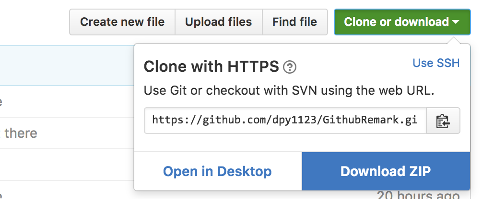
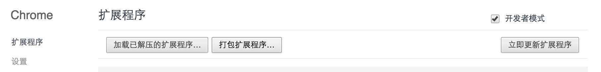

# GithubRemark
这是一个chrome插件，用于扩展Github的交友能力～  
虽然Github有name和username，但是还缺少像微信那样的备注名功能。此功能的缺失，对于现在二次元化的g友间的沟通和交往十分不利，因此本扩展应运而生～

## 安装
1.下载zip包解压到任意位置  
  
2.cd到解压的位置bower install一下  
3.打开chrome，扩展程序，勾选开发者模式，点击加载已解压的扩展程序，选择zip包解压的路径  
  
Done！

## 配置
当然使用之前需要配置一下userId，用来区分用户。  
在图标上右键->选项，即可指定用来识别你的userId。由于没有指定唯一性，请自觉使用区分度高的id，另外dpy1123已被占用！  
如果在使用时，发现没有设置过userId，会prompt让你输入的。 

## 使用
1.在图标上单击，选择on则开启功能。  
2.开启后，在原来username的位置后面会有“(no remark)”，里面是remark信息。直接双击可以添加或修改备注。  
在star follows following页面都可以增加备注～
